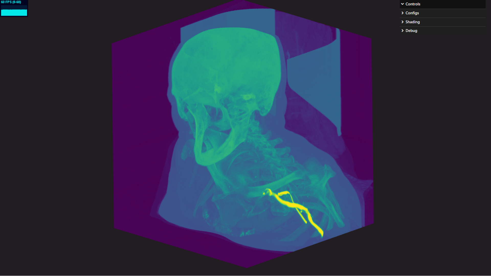
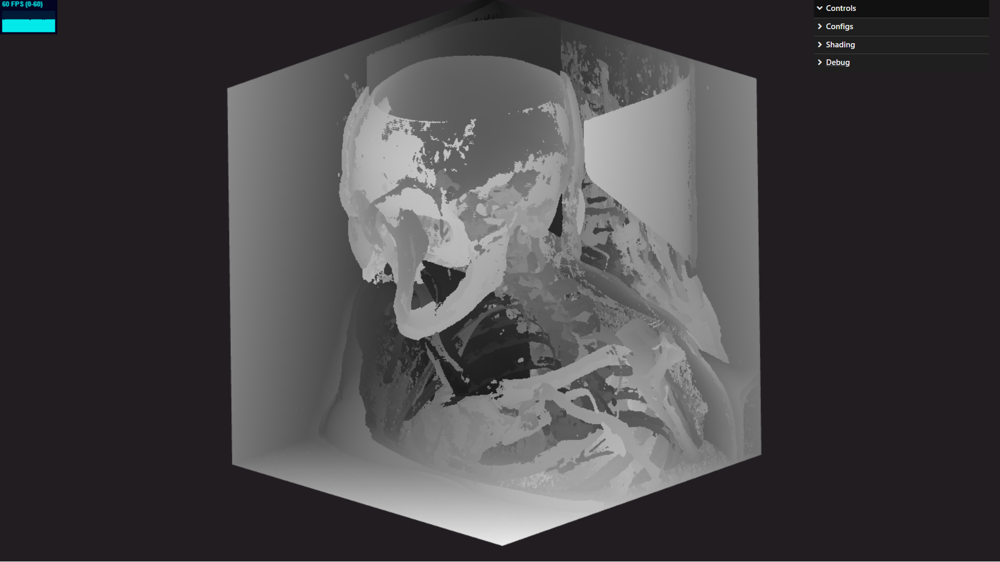
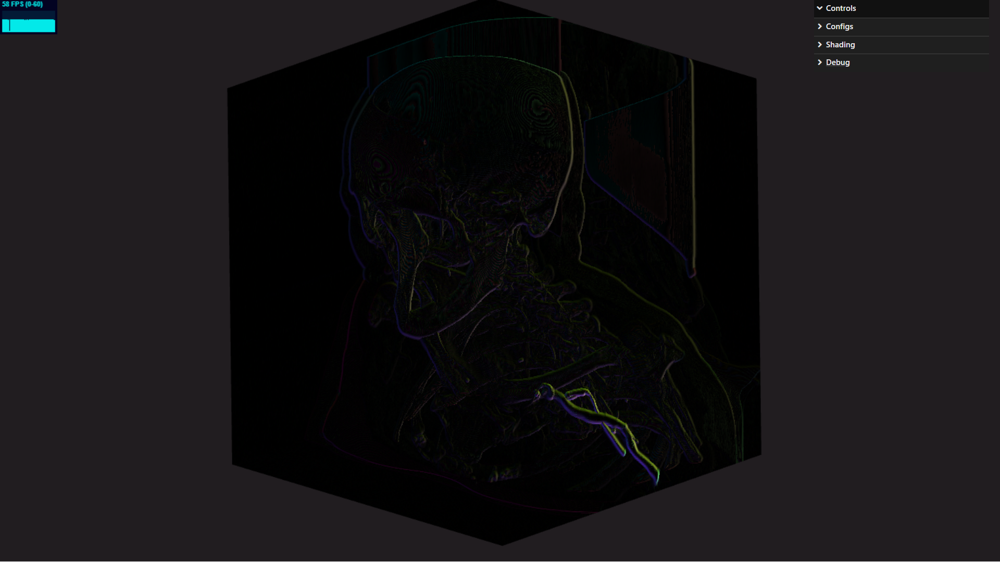
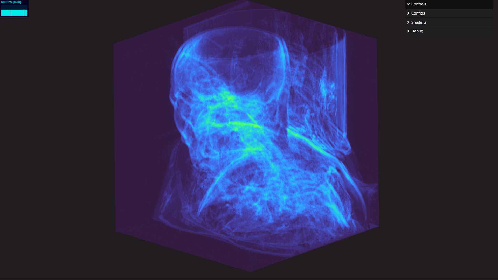

# MIP-Viewer

Browser-based maximum intensity projection (MIP) viewer for medical NIFTI volumes, built with Three.js, TensorFlow.js, and custom GLSL shaders.

This project focuses on interactive volume rendering in WebGL2, together with acceleration experiments based on precomputed shadow and distance maps, block-based skipping, and detailed shader debug views.

<p align="center">
  
</p>

<p align="center">
  Default scene: CTA head-and-neck volume rendered in the browser with an interactive MIP pipeline.
</p>

## Highlights

- Interactive maximum intensity projection rendering for 3D medical volumes directly in the browser.
- NIFTI loading pipeline with normalization and optional downscaling before rendering.
- TensorFlow.js preprocessing that generates acceleration textures for the viewer pipeline.
- Configurable marching modes, skipping strategies, skipping methods, gradients, and colormaps.
- Rich debug visualizations for ray state, MIP distance, MIP position, gradients, normals, steepness, and fetch counts.

## Gallery

<p align="center">
  
  
  
</p>


> ⚠️ **Note:** The demo does **not** run on mobile devices. Please open it on a desktop or laptop with GPU acceleration enabled. It takes around 1 min to load 

---

## 🛠️ Setup

First, install [Node.js](https://nodejs.org/en/download/).

Then run the following commands:

```bash
# Install dependencies (only required once)
npm install

# Start a local development server at localhost:8080
npm run dev

# Build for production (output in dist/ directory)
npm run build